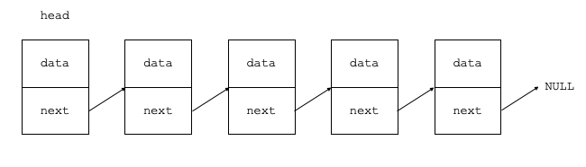

<!-- Title & Description -->
# Singly Linked List
A Singly Linked List is a *linked list* whose nodes have only two attributes, *data* and *next*, being next the node that follows the current one. Of course, depending on the language, if the node is the last one it's next attribute takes the value ```NULL```.

<!-- Illustration -->
<div align="center">
    
    <p><i>Example Image</i></p>
</div>

## Methods
| Method Name | Complexity | Status |
|:-------------:|:-------------:|:-------------:|
| addFirst() | ```O(1)``` | done |
| addLast() | ```O(n)``` | done |
| insert() | ```O(n)``` | done |
| removeFirst() | ```O(1)``` | done |
| removeLast() | ```O(n)``` | done |
| reverse() | ```O(n)``` | done |
| getElement() | ```O(n)``` | done |
| print() | ```O(n)``` | done |